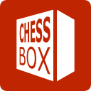
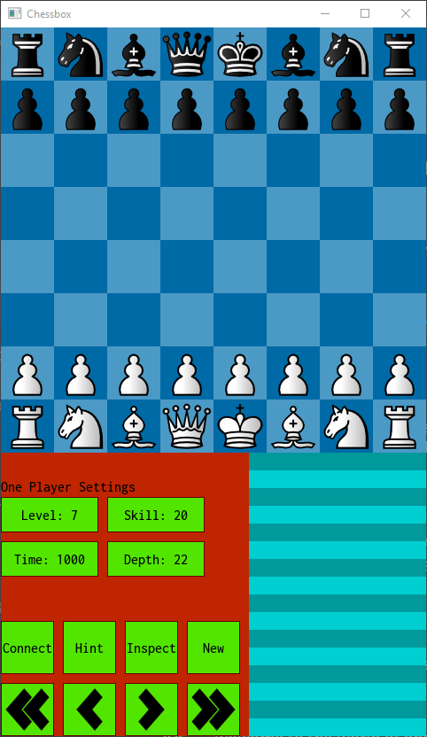

# Chessbox

Chessbox is the sum of three parts. The controller,  the GUI, and the hardware.

**The hardware** is the chess board with the LEDs, reed switches, MCPs and all the wires. You can read about building that on the [ChessLR blog](https://8bitcoder.com/chesslr).

> Note that Chessbox is the new name for ChessLR.

**The controller** is the interface to the hardware. It turns the LEDs on/off and uses the reed switches to sense when a piece is on a square. This runs on the PI.

**The GUI** is the user interface that a person interacts with to start a new game, set the skill level etc. The GUI also connects to a chess engine.  

# Building
- Use CLion, and open project at `/workspace/chessbox`. 
- Ensure that sdl is in workspace folder. /workspace/sdl/SDL2
- Select the **Controller GUI** run configuration to run.

# Running
You will need to start the controller in one terminal, then the GUI in another. You can run the GUI on the PI or if you can build and run in on your desktop.

## Controller 

    $ cd ~/workspace/chessbox/controller
    $ ./cbcontroller

## GUI

### Windows
From IDE, select the **Controller GUI** run configuration to run. It builds to 

### Linux

If you want the GUI to be full screen, use **-f**. **-e ./stockfish** points to the engine you want to use. 

    $ cd ~/workspace/chessbox/gui
    $ ./cbgui -f -e ./stockfish

Once the controller and GUI are running, click the **Connect** button to connect the GUI to the controller. (This will be automatic in later versions.) Now you can play as white. The computer will sense when you pick up pieces, and when you put it down if the move is valid it will respond and indicate the move it wants you to make for it. 

# Reference
- Chessbox [home page](https://8bitcoder.com/chessbox)
- UCI command reference [with notes](https://8bitcoder.com/uci), [original from Shredder](http://download.shredderchess.com/div/uci.zip)
- Chess rules from <https://github.com/billforsternz/thc-chess-library>
- Decent chess program, I used it for capturing FEN and testing PGN files. <https://github.com/billforsternz/tarrasch-chess-gui>
- [Stockfish](https://stockfishchess.org/) chess engine

