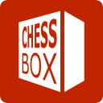

# Chessbox

Chessbox is the sum of three parts. The controller, the GUI, and the hardware.

**The hardware** is the chess board with the LEDs, piece switches, MCPs and all the wires. You can read about building that on the [Chessbox blog](https://8bitcoder.com/chessbox).

**The controller** is the software interface to the hardware. It turns the LEDs on/off and uses the piece switches to sense when a piece is on a square. This runs on the PI. 

**The simulator** is software with a GUI that pretends to be the controller and hardware. It allows the GUI to connect and think it is talking to the hardware. The simulator uses the same classes that the controller uses.

**The GUI** is the user interface that a person interacts with to start a new game, set the skill level etc. The GUI connects to a chess engine in order to know how to make moves.

> Currently working on the sim and gui to simplify the project and get the gui to the point I want, and also 
> to better workout the communication protocol between the controller/sim and the gui.

# Build and run
I used CLion to build and compile. Make sure the edit configuration points to the `controller-gui` folder for both 
`controller-gui` and `sim`. 

## GUI
See the [controller-gui/README](controller-gui/README.md).

## Simulator
See the simulator section of [controller-gui/README](controller-gui/README.md)..

# Directory Structure

| file/dir             | description                                  |
| -------------------- | -------------------------------------------- |
| common               | Common C files                               |
| controller           | Board controller in C                        |
| controller-gui       | GUI in C                                     |
| tiny-process-library | C lib                                        |

# Reference
- Chessbox [home page](https://axorion.com/chessbox)
- UCI command reference [with notes](https://8bitcoder.com/uci), [original from Shredder](http://download.shredderchess.com/div/uci.zip)
- Chess rules from <https://github.com/billforsternz/thc-chess-library>
- [Decent chess program](https://github.com/billforsternz/tarrasch-chess-gui) I used for capturing FEN and testing PGN files. 
- [Stockfish](https://stockfishchess.org/) chess engine

